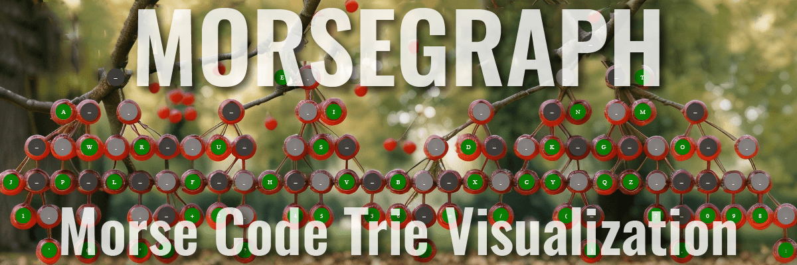

<!-- markdownlint-disable no-inline-html no-emphasis-as-heading -->
# Morsegraph




**Morse Code Trie Visualization Tool**

A Python-based utility to construct and visualize a
**[Trie](https://en.wikipedia.org/wiki/Trie)** (or "prefix tree") for
International Morse Code (ITU M.1677). This tool transforms linear
Morse sequences into a hierarchical structure, exporting it as both
machine-readable JSON and high-quality visualizations.

<!-- TABLE OF CONTENTS -->
<details closed="closed">
  <summary>
    <h2 style="display: inline-block">Table of Contents</h2>
  </summary>

- [Features](#features)
- [Example Output](#example-output)
- [Prerequisites](#prerequisites)
  - [System Dependencies](#system-dependencies)
  - [Python Dependencies](#python-dependencies)
- [Usage](#usage)
  - [Command Line Arguments](#command-line-arguments)
  - [Example With Arguments](#example-with-arguments)
- [Output](#output)
  - [JSON Output Structure](#json-output-structure)
- [How it Works](#how-it-works)
- [Contributing](#contributing)
- [License](#license)

</details>

## Features

- **ITU M.1677 Compliant:** Includes letters (A-Z), numbers (0-9), and
common punctuation as defined in
[ITU M.1677](https://www.itu.int/rec/R-REC-M.1677-1-200910-I/).
- **Hierarchical Visualization:** Generates clear, stylized graphs showing
how dots (`.`) and dashes (`-`) branch out to form characters.
- **Stylized Nodes:**
  - **Root:** Represented as a box.
  - **Intermediate Nodes:** Circles color-coded by sequence type (dots vs.
  dashes).
  - **Terminal Nodes:** Highlighted double-circles (green) representing the
  decoded character.
- **Multi-Format Export:** Generates output in `.json`, `.pdf`, `.png`,
`.svg`, and `.gv` (Graphviz) formats.
- **Customizable Layout:** Supports various graph orientations
(Top-to-Bottom, Left-to-Right, etc.).

## Example Output


## Prerequisites

### System Dependencies

You must have [Graphviz](https://graphviz.org/) installed on your system to
generate the visual diagrams.

- **macOS:** `brew install graphviz`
- **Ubuntu/Debian:** `sudo apt-get install graphviz`
- **Windows:** Download from [Graphviz.org](https://graphviz.org/download/)

### Python Dependencies

Install the required Python dependencies:

```bash
pip install -r requirements.txt
```

## Usage

Run the script from your terminal. By default, it creates an `./output`
directory with the generated files.

```bash
python morsegraph.py
```

### Command Line Arguments

You can customize the output using the following flags:

| Argument     | Default      | Description                                |
| :----------- | :----------- | :----------------------------------------- |
| `--basename` | `morsegraph` | The base filename for the generated files. |
| `--dir`      | `./output`   | The directory where files will be saved.   |
| `--rankdir`  |              | Direction of the graph                     |
|              | `TB`         | (Top-to-Bottom) (Default)                  |
|              | `LR`         | (Left-to-Right)                            |
|              | `RL`         | (Right-to-Left)                            |
|              | `BT`         | (Bottom-to-Top)                            |

### Example With Arguments

```bash
python morsegraph.py --basename my_morse_tree --dir ./exports --rankdir LR
```

## Output

Morsegraph generates output in multiple formats:

| File Type                        | Description                                                                               |
| -------------------------------  | ----------------------------------------------------------------------------------------- |
| [GV](./output/morsegraph.gv)     | Graphviz DOT file                                                                         |
| [JSON](./output/morsegraph.json) | A JSON file with the trie data (Refer to [JSON Output Structure](#json-output-structure)) |
| [PDF](./output/morsegraph.pdf)   | Portable Document Format                                                                  |
| [PNG](./output/morsegraph.png)   | Portable Network Graphics                                                                 |
| [SVG](./output/morsegraph.svg)   | Scalable Vector Graphics                                                                  |

### JSON Output Structure

Morsegraph produces a JSON file with the data used to construct the trie.
The generated JSON structure follows this recursive pattern:

```json
{
  ".": {
    "-": {
      "A": {
        "_end": true
      },
      "_end": false
    },
    "_end": false
  }
}
```

## How it Works

1. **Trie Construction:** The script iterates through the `MORSE_DATA`
list, breaking down sequences like `.-A` into a nested dictionary
structure.
2. **Logic Mapping:**
    - Each character in the sequence (dot or dash) becomes a node.
    - The final character in the sequence (the letter/number) is marked as
    a terminal state.
3. **Graph Generation:** The `pydot` library traverses the trie dictionary
to create a `digraph`.
4. **Export:**
    - The dictionary is dumped to **JSON** for programmatic use.
    - The Graphviz `dot` engine renders the visual files.

## Contributing

We welcome contributions! Here's how you can help:

- Add a [GitHub Star](github.com/pierow2k/morsegraph) to the
morsegraph project.
- Mention the morsegraph project on social media.
- Have an idea for a new feature or noticed something that isn’t working
quite right? [Open anissue](https://github.com/pierow2k/morsegraph/issues)
to let us know. Your feedback helps us keep morsegraph reliable and
feature-rich.
- **Submit a Pull Request**: If you’ve made improvements or fixed a bug,
we wouldd love to see your work.
[Submit a pull request](https://www.github.com/pierow2k/morsegraph/pulls)
and share your changes with the community.

We appreciate your support and contributions, which drive the continued
growth and success of morsegraph. Thank you for being part of the
journey!

## License

morsegraph is distributed under the MIT License. See the
[LICENSE](LICENSE) file for more details.
